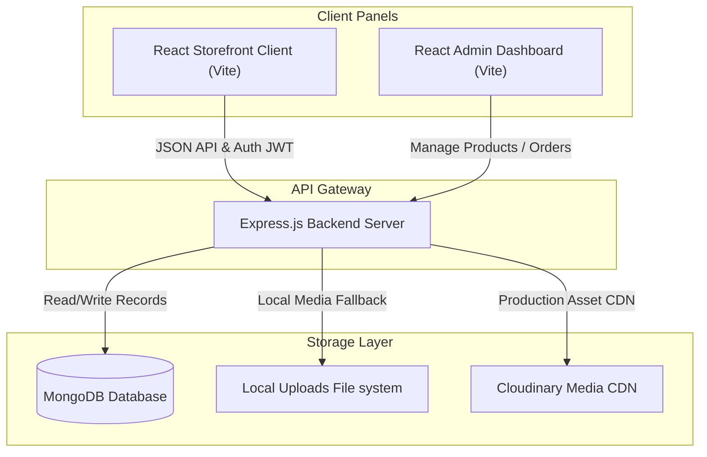

<div align="center">
  

  # 🧵 THREADLY
  ### **Cinematic, Awwwards-Inspired Luxury Fashion E-Commerce Platform**
  
  <p align="center">
    
    
    
    
    <br/>
    
    
    
    <br/>
    
    
    
  </p>

  <h4>
    <a href="#-visual-showcase--tour">Visual Showcase</a> •
    <a href="#%EF%B8%8F-system-architecture">Architecture</a> •
    <a href="#-key-features">Key Features</a> •
    <a href="#-quick-start-setup">Quick Start</a> •
    <a href="#-api-endpoints-reference">API Reference</a>
  </h4>

  ---
</div>

## 🌟 Overview

**Threadly** is an ultra-premium boutique e-commerce platform custom-engineered for the haute couture fashion domain. Breaking free from generic template-based designs, Threadly offers a **motion-first, cinematic shopping experience** inspired by award-winning portfolios on Awwwards.

Featuring **dynamic glassmorphism panels**, **fluid canvas effects**, and **meticulous typography**, Threadly combines high-fashion UI aesthetics with a highly resilient, recruiter-ready **MERN backend** that supports automated data seeding, local media uploads fallback, virtual payment sandboxes, and production-grade data persistence.

---

## 📸 Visual Showcase & Tour

Below is an interactive walkthrough showing Threadly's responsive layouts, editorial design, administrative dashboard, and user profile management:

<table border="0" cellspacing="10" cellpadding="10" width="100%">
  <tr>
    <td width="50%" valign="top" align="center">
      <h3>🌅 Cinematic Landing & Auth</h3>
      
      <p align="left"><em>A high-fashion landing screen featuring motion-first design, editorial light trails, and a sophisticated glassmorphic authentication panel (JWT-secured).</em></p>
    </td>
    <td width="50%" valign="top" align="center">
      <h3>🏛️ Luxury Storefront Home</h3>
      
      <p align="left"><em>An immersive storefront experience with an editorial catalog view, custom brand logo integration, trending item cards, and smooth micro-interactions.</em></p>
    </td>
  </tr>
  <tr>
    <td width="50%" valign="top" align="center">
      <h3>👗 Curated Collections</h3>
      
      <p align="left"><em>Advanced catalog navigation with full search capability and nested filters for sorting collections by category, subcategory, price, or tags.</em></p>
    </td>
    <td width="50%" valign="top" align="center">
      <h3>🛍️ Product Detail View</h3>
      
      <p align="left"><em>High-definition product previews, custom size selectors, description tabs, and a fluid slide-out shopping cart drawer.</em></p>
    </td>
  </tr>
  <tr>
    <td width="50%" valign="top" align="center">
      <h3>👤 Premium Profile & History</h3>
      
      <p align="left"><em>Dedicated user workspace featuring past order summaries, shipment statuses, delivery timelines, and customer information.</em></p>
    </td>
    <td width="50%" valign="top" align="center">
      <h3>⚙️ Elite Admin Panel</h3>
      
      <p align="left"><em>A comprehensive dashboard for operators to execute product CRUD (create, read, update, delete) operations and track real-time order fulfillments.</em></p>
    </td>
  </tr>
</table>

---

## 📐 System Architecture

Threadly is organized into three major layers. The frontend clients (Storefront and Admin Dashboard) interact with the backend node server via JSON REST APIs.



---

## ✨ Key Features

### 🎨 Frontend & Design Excellence
* **Awwwards-Inspired Visuals:** Elegant dark theme option, stunning landing backdrop, fluid custom scrollbars, and fine typography.
* **Motion-First UI:** Powered by `framer-motion` for buttery smooth transitions, expanding panels, sliding drawers, and micro-interaction states.
* **Responsive Layouts:** Meticulously optimized for all screen sizes, from mobile phones to high-resolution widescreen monitors.

### 🛡️ Self-Healing Backend
* **Robust Media Upload Fallbacks:** Automatically redirects media uploads to the local filesystem if Cloudinary credentials (`CLOUDINARY_*`) are not configured, maintaining 100% catalog upload functionality out-of-the-box.
* **Stripe Sandbox Simulation:** If Stripe secret keys are omitted, the backend automatically transitions to a mock Stripe checkout simulation, keeping the payment funnel active.
* **Virtual Razorpay Simulator:** Includes a built-in virtual test gateway. It permits testing the native Razorpay flow interactively on localhost without key limits or checkout crashes.
* **Automatic Database Seeding:** The API automatically seeds the MongoDB collection with premium fashion catalogs and categories upon its very first connection.
* **Production Persistence:** Built with robust schema designs, ensuring all custom-added products, order histories, and cart configurations are permanently stored and retrievable after server restarts.

---

## ⚙️ Quick Start Setup

Follow these steps to run the complete MERN application on your local development machine.

### Prerequisites
* **Node.js** (v18.x or higher recommended)
* **MongoDB** (Local instance running at `mongodb://localhost:27017` or a MongoDB Atlas URI string)

---

### 1. Environment Configuration

1. Clone the repository and navigate to the project directory:
   ```bash
   git clone https://github.com/your-username/threadly.git
   cd threadly
   ```

2. Create a `.env` file inside the `backend/` directory:
   ```bash
   touch backend/.env
   ```

3. Populate the `backend/.env` file with the following variables:
   ```env
   # JWT & Admin Configuration
   JWT_SECRET=super_secret_jwt_key
   ADMIN_EMAIL=admin@example.com
   ADMIN_PASSWORD=admin_secure_password123

   # Database Connection
   MONGODB_URI=mongodb://localhost:27017/threadly

   # Optional: Cloudinary CDN Config (Local fallback is used if empty)
   CLOUDINARY_API_KEY=
   CLOUDINARY_SECRET_KEY=
   CLOUDINARY_NAME=

   # Optional: Payment Keys (Simulators are triggered if empty)
   STRIPE_SECRET_KEY=
   ```

---

### 2. Single-Command Launch

Threadly includes workspace orchestration scripts in the root `package.json` to boot the client, admin, and backend server simultaneously.

From the **root folder**, run:

```bash
# Install dependencies across all modules (root, backend, frontend, admin)
npm run setup

# Launch the backend server, client storefront, and admin panel concurrently
npm start
```

* 🛍️ The **Client Storefront** will open at `http://localhost:5173`
* ⚙️ The **Admin Dashboard** will open at `http://localhost:5174` (or next available port)
* 📡 The **Backend REST API** runs at `http://localhost:4000`

---

## 📡 API Endpoints Reference

### 🔐 Authentication & User Operations

| Method | Endpoint | Description | Auth Requirement |
| :--- | :--- | :--- | :--- |
| `POST` | `/api/user/register` | Registers a new storefront customer account | None |
| `POST` | `/api/user/login` | Authenticates a customer and returns a JWT | None |
| `POST` | `/api/user/admin` | Authenticates an admin and returns an admin token | Admin Credentials |

### 📦 Product & Catalog Management

| Method | Endpoint | Description | Auth Requirement |
| :--- | :--- | :--- | :--- |
| `GET` | `/api/product/list` | Returns a list of all products in the database | None |
| `POST` | `/api/product/add` | Uploads and adds a new product item | Admin Token (JWT) |
| `POST` | `/api/product/remove` | Deletes a product item from the database | Admin Token (JWT) |

### 💳 Checkout & Order Processing

| Method | Endpoint | Description | Auth Requirement |
| :--- | :--- | :--- | :--- |
| `POST` | `/api/order/place` | Places a new order using Cash on Delivery (COD) | User JWT |
| `POST` | `/api/order/stripe` | Initiates a Stripe checkout flow (or triggers mock Stripe checkout) | User JWT |
| `POST` | `/api/order/verifyStripe` | Verifies a completed Stripe session payment | User JWT |
| `POST` | `/api/order/razorpay` | Initiates a Razorpay order (or triggers native simulator) | User JWT |
| `POST` | `/api/order/verifyRazorpay` | Verifies a completed Razorpay payment | User JWT |

---

<div align="center">
  <p>Crafted with 🖤 for the luxury fashion tech ecosystem.</p>
</div>
